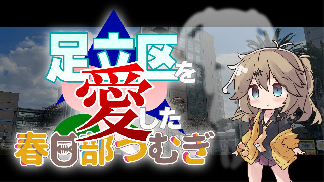

本プラグインは、動画・静止画内の人物の顔を隠すAfter Effectsプラグインです。  
人物の顔を自動で認識し、その上にマスク画像を被せます。  
マスク画像は人物の顔の位置を自動で追従します。

**⚠️Windowsは未検証です（動きません・検証予定なし🙇‍♂）⚠️**  
**⚠️α版です⚠**


## サンプル

下記動画で使用しています。  


  


[【足立区を愛した春日部つむぎ】第1話 お前も足立区民にしてやろうか！](https://www.nicovideo.jp/watch/sm43658733)


## 感謝

### YOLO v8

人物の認識だけでなく、追従までしてくれるライブラリです。感謝。  
https://docs.ultralytics.com/ja/


### Bolt CEP

CEPの世界にES6やTypescriptをはじめとした様々な恩恵をもたらします。感謝。  
https://github.com/hyperbrew/bolt-cep


## 検証環境

下記環境で検証しています。  

- MacBook Air (M1, 2020)
- macOS Monterey (12.6.7)
- Adobe After Effects 2024
- Python 3.11.2
- 30fps


## インストール

**⚠️α版のため、パッケージの配布をしていません。インストールには知識を要します⚠**

本プラグインはトラッキングにYOLO v8を使用しています。  
このため、Pythonの実行環境が必要です。

### Pythonのインストール

Pythonをグローバルにインストールしてください。
After Effectsから外部コマンドを起動する場合、パスが /usr/bin:/bin:/usr/sbin:/sbin にしか通ってないようなのでインストール先に注意してください。  
特に、pyenvなどのバージョン管理ツールを使用している場合はcommand not foundになるかもしれません（なりました）。  
その場合は仮想環境を使用してください（後述）。

### Pythonライブラリのインストール

下記ライブラリをグローバルか仮想環境にインストールしてください。

```sh
pip install ultralytics scikit-learn
```

### 本プラグインのインストール

```sh
git clone git@github.com:nyankomaher/face-tracker.git
cd face-tracker
yarn install
yarn build
yarn dev
```

After Effectsを再起動すれば[ウィンドウ] → [エクステンション]に「Face Tracker」が追加されます。


## 使用方法

1. ウィンドウ → エクステンション → Face Trackerを選択し、Face Trackerのパネルを表示します。
2. プロジェクトパネルでマスクに使用する画像を選択し、Face Trackerパネルで「マスク画像」の「選択」ボタンを押下します。
3. プロジェクトパネルでトラッキングする動画または静止画を右クリックし、「選択範囲から新規コンポジション」を選択します。
4. タイムラインパネルで上記で作成したコンポジションを開き、トラッキングする動画または静止画のレイヤーを選択します。
5. Face Trackerパネルで「トラッキング開始」ボタンをクリックします。
6. トラッキングが開始されるので、終了を待ちます。諸条件にもよりますが、時間がかかります。
7. トラッキングが終了すると、タイムラインパネルにマスクが追加されます。

### 「選択範囲から新規コンポジション」について

この操作は必須ではありません。  
以下の条件を満たす任意のコンポジションを利用できます。  

- コンポジションのサイズが解析対象の映像のサイズと一致していること。
- コンポジションのフレームレートが動画のフレームレートと一致していること。
- コンポジションのデュレーションが動画のデュレーションと一致していること。
- 動画または静止画が0フレームから開始すること。
- 動画がトリミングされていないこと。

手っ取り早くこの条件を満たせるのが「選択範囲から新規コンポジション」だということです。

### 対応フォーマット

解析対象の映像は下記のフォーマットに対応しています。  

- 動画： YOLO v8が対応している形式（mp4, movは動作しました）
- 画像： jpg, png

### プラグインが追加するリソース

本プラグインはプロジェクトに「nyankomaher-face-tracker」というフォルダを作成します。
また、コンポジションに「nyankomaher-face-tracker.jsx」というレイヤーを追加します。
このフォルダ・ファイルを削除、変更しないでください（レイヤーの移動は可）。


## 設定

| 設定             | 説明                                                                                                                                                                | 
| ---------------- | ------------------------------------------------------------------------------------------------------------------------------------------------------------------- | 
| プリセット       | 新規ボタンを押下して現在の設定を保存できます。保存した設定はプルダウンで選択し、適用ボタンを押下することで適用できます（プルダウンを変更しただけでは適用されません）。                                              | 
| 解析サイズ       | 映像を解析する際、映像をここで指定した幅にリサイズして解析します。サイズを大きくすれば精度は向上しますが、解析時間は長くなります。                                  | 
| 解析間隔         | 映像を解析する際、ここで指定したフレーム数に1回解析を行います。間隔を大きくすれば解析時間を短縮できますが、精度は低下します。                                       | 
| 重複領域閾値     | 検出した複数の人物領域に重なりがある場合、この値以上重なっている場合は同一の人物とみなします（IoU）。                                                             | 
| 確信度閾値       | 映像を解析する際、どの程度の人物っぽければ人物として検出するかの閾値です。                                                                                            | 
| マスク画像拡張   | マスクの画像をこの値の倍率で拡大・縮小できます。この値が1のとき、マスク画像の幅は人物の幅と同じです。                                                                          | 
| マスク時間拡張   | マスクの表示時間をこの値のフレーム数分、延長・短縮できます。延長すると、トラッキングの開始と終了が不安定になりやすくなります。この値が0のとき、マスク画像は人物の検出開始と検出終了に合わせて表示されます。                                       | 
| 最小マスクサイズ | マスクはここで指定した幅より小さくなりません。                                                                                                                  | 
| マスク位置補間  | マスクのXY座標の補間法です。                                                                                                                                        | 
| マスクサイズ補間 | マスクのサイズの補間法です。                                                                                                                                        | 
| GPU            | GPUを使用します。お使いのマシンが対応していれば解析速度が高速になります。                                                                                                      | 
| Python         | Pythonの仮想環境を使用する場合、ここにpythonのフルパスを入力してください（例：/path/to/your/venv/bin/python）。                                                                                        | 
| スクリプト       | モデルを変更したい、トラッキングの設定を変えたい、人間以外を追従したい、GPUを使いたいなどの場合、 src/js/public/bin/track.py をカスタマイズして、独自の人物認識・追従を実装することができます。その場合、ここにカスタマイズしたファイルのフルパスを入力してください。 | 


## 注意点

### 精度

本プラグインでは100%の精度で顔を隠すことを想定して作られていません。  
ある程度自動化し、手動で調整することを想定しています。  
サンプルの動画では、10人ほどマスクのサイズを拡大したり、キーフレームを手打ちしたりしています。  
また、誤検出したマスクのうち気になるものを30個ほど削除しています。  
  
また、本プラグインは街や観光地で撮影した動画に映り込む人の顔を隠すことを想定してチューニングしています。  
それとは異なる種類の動画では精度が落ちるかもしれません。  

### 動作ロジックと苦手なシチュエーション

本プラグインはFace Trackerと名乗ってはいますが、人物の顔を検出しているわけではなく、人物の体全体を検出しています。  
（顔の検出では遠くの人物、横や後ろから見た顔などの検出精度と速度のバランスに満足できなかったのでこのようになりました）  
そして検出した領域の上側、頭がありそうな位置にマスクを配置します。  
マスクの幅は検出した人物の幅と同じです。  
したがって、下記の状況では人物の幅や高さが正しく検出できず、マスクのサイズが実際の顔の領域より大きくなったり、位置が適切でなくなったりします。  

- 人物が手を広げたり大きく振ったりしている場合
- 座っている人を横から撮った場合
- 人物が斜めに映っている場合
- 人物が画面端に見切れている場合

大きな動きをするとマスクが外れやすくなります。  
人物が動かなくても、カメラを横にパンするなど大きく動かした場合、マスクが外れる可能性が非常に高くなります。


## ライセンス

AGPL-3.0